# Session Recaps History

## Table of Contents
* January 28th, 2021 <g-emoji class="g-emoji" alias="calendar" fallback-src="https://github.githubassets.com/images/icons/emoji/unicode/1f4c6.png">📆</g-emoji>
  * [Optimizing For Promotion In Tech](#optimizing-for-promotion-in-tech)
* February 3rd, 2021 <g-emoji class="g-emoji" alias="calendar" fallback-src="https://github.githubassets.com/images/icons/emoji/unicode/1f4c6.png">📆</g-emoji>
  * [Evolving Your Job As Your Company Changes](#evolving-your-job-as-your-company-changes)
* February 11th, 2021 <g-emoji class="g-emoji" alias="calendar" fallback-src="https://github.githubassets.com/images/icons/emoji/unicode/1f4c6.png">📆</g-emoji>
  * [Building Meaningful Side Projects](#building-meaningful-side-projects)
* February 13th, 2021 <g-emoji class="g-emoji" alias="calendar" fallback-src="https://github.githubassets.com/images/icons/emoji/unicode/1f4c6.png">📆</g-emoji>
  * [What Does a Product Manager Do And Why You Should Become One](#what-does-a-product-manager-do-and-why-you-should-become-one)
* February 18th, 2021 <g-emoji class="g-emoji" alias="calendar" fallback-src="https://github.githubassets.com/images/icons/emoji/unicode/1f4c6.png">📆</g-emoji>
  * [Productivity Tips as an Engineer](#productivity-tips-as-an-engineer)
* February 20th, 2021 <g-emoji class="g-emoji" alias="calendar" fallback-src="https://github.githubassets.com/images/icons/emoji/unicode/1f4c6.png">📆</g-emoji>
  * [How To Build A Successful Startup](#how-to-build-a-successful-startup)
* February 25th, 2021 <g-emoji class="g-emoji" alias="calendar" fallback-src="https://github.githubassets.com/images/icons/emoji/unicode/1f4c6.png">📆</g-emoji>
  * [How To Learn Quickly In The Tech Industry](#how-to-learn-quickly-in-the-tech-industry)
* March 4th, 2021 <g-emoji class="g-emoji" alias="calendar" fallback-src="https://github.githubassets.com/images/icons/emoji/unicode/1f4c6.png">📆</g-emoji>
  * [How To Ace Your Tech Interview](#how-to-ace-your-tech-interview)
* March 4th, 2021 <g-emoji class="g-emoji" alias="calendar" fallback-src="https://github.githubassets.com/images/icons/emoji/unicode/1f4c6.png">📆</g-emoji>
  * [How To Ace Your Tech Interview](#how-to-ace-your-tech-interview)
* March 11th, 2021 <g-emoji class="g-emoji" alias="calendar" fallback-src="https://github.githubassets.com/images/icons/emoji/unicode/1f4c6.png">📆</g-emoji>
  * [Choosing Your Path As A Software Engineer](#choosing-your-path-as-a-software-engineer)
* March 18th, 2021 <g-emoji class="g-emoji" alias="calendar" fallback-src="https://github.githubassets.com/images/icons/emoji/unicode/1f4c6.png">📆</g-emoji>
  * [Using Content Creation To Boost Your Tech Skills](#using-content-creation-to-boost-your-tech-skills)
* March 25th, 2021 <g-emoji class="g-emoji" alias="calendar" fallback-src="https://github.githubassets.com/images/icons/emoji/unicode/1f4c6.png">📆</g-emoji>
  * [Succeeding as a Self Taught Dev/Bootcamp Grad](#succeeding-as-a-self-taught-devbootcamp-grad)
* April 10th, 2021 <g-emoji class="g-emoji" alias="calendar" fallback-src="https://github.githubassets.com/images/icons/emoji/unicode/1f4c6.png">📆</g-emoji>
  * [How To Build Side Project Apps With 100k+ Users (For Free!)](#how-to-build-side-project-apps-with-100k-users-for-free)
* May 1st, 2021 <g-emoji class="g-emoji" alias="calendar" fallback-src="https://github.githubassets.com/images/icons/emoji/unicode/1f4c6.png">📆</g-emoji>
  * [How To Ace Your Top Big Tech Company Software Interview](#how-to-ace-your-top-big-tech-company-software-interview)
* May 15th, 2021 <g-emoji class="g-emoji" alias="calendar" fallback-src="https://github.githubassets.com/images/icons/emoji/unicode/1f4c6.png">📆</g-emoji>
  * [How To Become A 10x Engineer](#how-to-become-a-10x-engineer)
* May 29th, 2021 <g-emoji class="g-emoji" alias="calendar" fallback-src="https://github.githubassets.com/images/icons/emoji/unicode/1f4c6.png">📆</g-emoji>
  * [How To Write A More Effective Tech Resume To Get More Job Opportunities](#how-to-write-a-more-effective-tech-resume-to-get-more-job-opportunities)
* June 19th, 2021 <g-emoji class="g-emoji" alias="calendar" fallback-src="https://github.githubassets.com/images/icons/emoji/unicode/1f4c6.png">📆</g-emoji>
  * [How To Come Up With 100k+ Users App Ideas You Can Build For Free](#how-to-come-up-with-100k-users-app-ideas-you-can-build-for-free)
* July 9th, 2021 <g-emoji class="g-emoji" alias="calendar" fallback-src="https://github.githubassets.com/images/icons/emoji/unicode/1f4c6.png">📆</g-emoji>
  * [How To Manage Your Time Optimally In Tech And Achieve More Results](#how-to-manage-your-time-optimally-in-tech-and-achieve-more-results)
* July 17th, 2021 <g-emoji class="g-emoji" alias="calendar" fallback-src="https://github.githubassets.com/images/icons/emoji/unicode/1f4c6.png">📆</g-emoji>
  * [How To Ace Your Big Tech Interview With Data Structures And Algorithms](#how-to-ace-your-big-tech-interview-with-data-structures-and-algorithms)
* July 21st, 2021 <g-emoji class="g-emoji" alias="calendar" fallback-src="https://github.githubassets.com/images/icons/emoji/unicode/1f4c6.png">📆</g-emoji>
  * [How To Get Promoted Faster In Tech](#how-to-get-promoted-faster-in-tech)
* August 4th, 2021 <g-emoji class="g-emoji" alias="calendar" fallback-src="https://github.githubassets.com/images/icons/emoji/unicode/1f4c6.png">📆</g-emoji>
  * [Answering Your Top 5 Questions](#answering-your-top-5-questions)
* August 28th, 2021 <g-emoji class="g-emoji" alias="calendar" fallback-src="https://github.githubassets.com/images/icons/emoji/unicode/1f4c6.png">📆</g-emoji>
   * [How To Write A Stellar Tech Resume That Gets You More Job Opportunities](#how-to-write-a-stellar-resume-that-gets-you-more-job-opportunities)
* October 2nd, 2021 <g-emoji class="g-emoji" alias="calendar" fallback-src="https://github.githubassets.com/images/icons/emoji/unicode/1f4c6.png">📆</g-emoji>
   * [How To Build And Grow Tech Products To 500k+ Users For Free](#how-to-build-and-grow-tech-products-to-500k-users-for-free)
* October 16th, 2021 <g-emoji class="g-emoji" alias="calendar" fallback-src="https://github.githubassets.com/images/icons/emoji/unicode/1f4c6.png">📆</g-emoji>
   * [How To Learn Quickly In Tech](#how-to-learn-quickly-in-tech)
* November 6th, 2021 <g-emoji class="g-emoji" alias="calendar" fallback-src="https://github.githubassets.com/images/icons/emoji/unicode/1f4c6.png">📆</g-emoji>
   * [How To Ace Your Big Tech Interview - System Design](#how-to-ace-your-big-tech-interview---system-design)

## Optimizing For Promotion In Tech
Our recap for this first session was actually quite brief as this was before the Slack community and @Rahul Pandey and I had 0 clue what we were doing. So here's a real recap of that session:
* Promotion is about behavior, not output
  * This is the #1 most important thing about promotion if you're only going to retain 1 thing from this recap, make it this.
  * You can only scale output so much as you are limited by the number of hours in a day and how much you can push your body/mind before it burns out.
  * Senior engineers are senior because they add multiplicative value, not additive. They build solutions that help broad swaths of people across the company, not 1-off implementations for random features that junior engineers are often saddled with.
* Perception matters. Acting altruistically will give you a higher chance of promotion
  * In the end, you always work on a team. Don't be someone who only cares about promotion as this will lead to toxic and territorial behavior that ultimately hurts your chances of promotion.
  * Engineers become more senior because they increase their scope, helping and empowering more people across the company. You can't do this if you act in a selfish way.
* Proper self-presentation is crucial
  * In an ideal world, your manager and everyone in your reporting chain would automatically know all the hard work you did and you'll get promoted every time you deserve it. That is not the case, especially in a fast-moving, chaotic company (which most top tech companies like Facebook are).
  * At Facebook, there is something called the "self-review" where you laid out everything major you did and the impact you had in an organized way. If the company doesn't force you to do this, you should just do it yourself whenever it's promo season.
  * It is immensely helpful to keep a running journal of everything you did each week, so you don't need to claw back 6-12 months into the past every promo cycle.
* Switching companies is a powerful lever
  * Companies are not exactly pure engines of goodwill, even top tech companies like Facebook.
  * Often times you will be kept stagnant in your current job due to some mix of stupid obstacles. In this scenario, keep finding a job at a different company in mind as a powerful option. If you're a good engineer and you do well on a company's interview, they need to sweeten the deal to make up for the friction of you leaving your current job to join them. This can end up being a promotion!

## Evolving Your Job As Your Company Changes
Recap of the session with Girish, who's currently an engineering director at Chan Zuckerberg Initiative and was at Facebook for a whopping 11 years:
* There isn’t a single correct answer for which company you should join early in your career. However, joining a mid-sized, fast growing company offers a good combination of great mentorship + responsibility.
* Small companies will give you less mentorship but you’ll likely have wider responsibilities. You probably won’t become an industry expert, but you’ll figure out how everything fits together.
* Large companies will allow you to focus on a particular niche and tackle problems that most others don’t have the luxury of tackling. You’ll also have well-defined paths for career progression + the ability to switch teams if you want. In particular, you will learn how to actually scale products to millions if not billions of users.

## Building Meaningful Side Projects
Recap:
1. Don't be afraid to build something "boring" - It is easy to get lost working with something "cool" like blockchain where your chances of success are low due to the unknowns and instability associated with that tech. There is tremendous value in building a powerful solution to a relatively small problem, more than most people think. If you are on the more junior side, it also makes more sense to start off with something simple for the sake of your gradual progression. You don't become a master overnight.
2. It takes time for a product to take off - It usually takes at least a couple iterations for your product to have enough features and be polished enough to reach a critical mass of users who find it genuinely useful. Don't just expect to drop a raw MVP (minimum viable product) and expect it to take off. Most of a product's value comes from the execution, not the raw idea itself.
3. Solve a problem you are close to - By solving for a problem you or someone close to you has, you will naturally be more passionate and motivated about solving that problem. Once you have the product out, you will also be able to get valuable feedback on the product easily, either from yourself or that person close to you. By "feeling the pain" of every bug and inefficiency your product has, you can craft a truly elegant solution. If you solve for a problem that you aren't really close to, you won't be able to build that true user understanding and will likely end up with a product that either solves nothing or solves a problem extremely poorly.

[Link to all of my side projects (~2 million installs)](https://play.google.com/store/apps/dev?id=9093438553713389916)

## What Does a Product Manager Do And Why You Should Become One
Recap of the session with Tulsee, who's currently a Google Product Lead for ML Fairness and Responsible AI:
* PMs are the voice of the user and decide the direction of the product. Being a PM typically means you have much more scope than an equivalent level engineer (at least early in your career)
* The job of a PM is largely “influence without authority”, so you structure the framework for decision-making, pull in the right data, and work with stakeholders w/o always being the final decision maker
* APM (Associate Product Manager) Programs are a nice, structured way to become a PM, with support + training

## Productivity Tips as an Engineer
* Solve the hardest problem first
  * It may be tempting to solve the easiest problems first, but this can leave you with a false sense of confidence.
  * Often times what turns out to be the solution to the hardest problem will have ramifications all across the architecture. Solving the core, central hard problem can transform what you thought were the “easy” tasks before.
  * Tackling the hardest problem first is also crucial to failing fast. Sometimes the hardest problem is literally an impossible problem. The sooner you figure that out, the sooner you can kill the project and move on.
* Build as much as you can like a library
  * Alex did the same with his side projects. He is able to write thousands of lines of code per day, because a lot of it is frankly copy-paste. He can copy-paste it, because he always designs his code as modules, so at least 50% of his code is “drag-and-dropp-able”.
  * A concrete way to think about this idea is “Avoid monoliths”. Bad engineers in particular will create massive classes that hold all their logic; this is usually the view controller when you’re building user-facing products. When you do this, pretty much none of your code is reusable.
* Learn when to skip meetings
  * One of the easiest ways to waste your time, especially in older, more bureaucratic companies, is to languish in meetings.
  * If your work culture allows for it like Facebook, don’t be afraid to skip meetings. There is a “Reject invite” button for a reason.
* Identify if you’re a context switcher or focuser and build around that
  * If you’re a context switcher: Great! The main things to do here are to continue building the muscle by context switching more often and being able to identify pockets of time where you can be productive.
  * If you don’t like context switching and are the most productive when you are able to focus, make focus blocks. Concentrate similar work (like meetings) on certain days. Aggressively reject non-relevant meetings.
* Keep a journal and stay in tune with your gut
  * Figuring out how to maximize your productivity is a self-learning exercise. Most people in the beginning of their careers do not know what circumstances they need to shine.
  * Keep some sort of record of what you are doing week or week (or even day over day) and regularly reflect on which weeks were bad (“Argh, I got nothing done”) and which ones were good (“Wow, I crushed it”). Think about why the good weeks were good and why the bad weeks were bad.
  * Be honest with yourself, particularly with things you don’t like. If something feels like a chore, recognize it and tell your manager.

On a side note, notion is supposedly a great note taking tool: https://www.notion.so/

[LinkedIn Event](https://www.linkedin.com/events/6766888028293214208/)

## How To Build A Successful Startup
Recap of the session with @Clarence Chio, the founder of Unit21, a security startup that's funded by Google and recently secured its Series A:
* You must talk to customers and understand what product to build. You cannot build your way to a solution in a startup. Put in a very concrete way, building actually comes last.
* You will likely be very bad at hiring and managing a team as a first time founder. Find a coach who can help you get better, and be prepared to learn on the job.
* Finding a community of like-minded people is important for finding a cofounder and committing to a startup. Clarence was part of South Park Commons for example, a community of domain experts where everyone can jam on ideas together.

[LinkedInEvent](https://www.linkedin.com/events/6766892651678724096/)

## How To Learn Quickly In The Tech Industry
* Don't be afraid to ask questions
  * If there's a metric you should judge yourself against in your first 2 months on a new team, it's how many questions you ask.
  * It is not a sign of strength to "tough it out" and figure out a complex thing on your own after several days/weeks when you can figure it out in just 30 minutes by asking someone for help. It is a sign of weakness to do this as you are afraid to confront your own weaknesses. Conversely, it is a sign of emotional strength to be vulnerable and share this with someone else, asking them for help.
  * There is no such thing as a stupid question. Don't fret too much about the optics of your question and just ask!
  * In the end, you will "feed back into" the balance as you will eventually reach a point where you are the one answering questions. By helping foster a truly open culture where anybody is comfortable asking or answering a question, you set up your entire team for success.
* Ask effective questions
  * In general, try to unblock yourself for 15-30 minutes before asking a question, a few hours tops. You just want to avoid the nightmare scenario from before where you just bang your head against a wall for days/weeks.
  * Explain where you are now. Detail what you tried already and what outcome it produced. You should have this from the 15-30 minutes of work mentioned before. Your goal here is to cut out the wasteful feedback loops where you go to someone and they ask if you have already done some pretty obvious thing (which you should have done in that 15-30 minutes).
  * Be polite - Make it clear that you respect the answerer's time by including phrases like "Whenever you get a moment" and "If you're too busy, no worries if you can't answer". Always thank the answerer, even if they didn't give you a complete answer or any answer at all. Remember, the answerer gifted you their most valuable resource: Time.
  * Attach resources - Screenshot, stack traces, actual code: Doesn't matter what it is, just attach it to your question. A picture (or code snippet) is worth 1,000 words.
* Work backwards from where you want to be
  * When you focus only on what you already have and are now, it's easy to get tunnel vision, lose sight of the bigger picture, and fall into a reactive state. When you're just starting a project, it's also common to just feel helpless when you're only thinking of where you are now because you simply have nothing.
  * By working backwards and envisioning every single piece that needs to fall into place, it forces you to have a holistic view of the system. From there, you can break the overall system into components and then talk to the proper POC for each component to get a high-level overview of the entire system, putting you well on your way towards becoming a lead in that space.

Here's also a very tactical "playbook" to becoming familiar in a new team:
[A Career Cold Start Algorithm" from Andrew Bosworth, a Facebook VP](https://boz.com/articles/career-cold-start)

[LinkedIn Event](https://www.linkedin.com/events/6769366496738185216/)

## How To Ace Your Tech Interview
**Overall Approach**
1. Interviews suck but they get better as you do more of them. Use companies you're less excited about as practice fodder.
2. Try to pack together all interviews with companies you care about within the same time window, so you can get a slew of competing offers to maximize your compensation.
3. Interview even if you're happy with your job. If it's been a couple years and you have a bit of an itch for something new, just put yourself out there. It's a good exercise to keep this crucial muscle in check, explore the world, and get a feeling on whether you are being paid what you're worth.

**Preparation**
1. If you have a big company interview, just get Leetcode Premium. It's such a no brainer - You are literally paying 35 or 70 dollars to increase your chances of landing a prestigious $100k+ job by several percentage points.
2. Find a buddy to mock interview you! It's so valuable being able to bounce ideas off of a human. 
https://interviewing.io/ is a tool that lets you do this and has a free tier.
3. Take frequent breaks! Alex takes a ~30 minute break (about enough for an episode of something on Netflix, haha) for every ~2 hours of work.

**During the interview**
1. Interviews should feel more like a conversation vs. a test. A good interviewer is trying to bring out the best in you. Let them do that by having a healthy dialogue with them vs. staying silent.
2. Done is better than perfect. It's always good to present multiple options, especially the bad ones. It shouldn't be your goal to jump to the optimal solution immediately.

**Post interview**
1. Take the part where you can ask the interviewer questions about the company seriously. Avoid the generic "What is your favorite thing about the company?" and "What is your day to day like?" Ask questions that make the interviewer think and cover the company's future.
2. Interviews produce a lot of false negatives and can frankly be stupid a lot of the time. Don't get too down when you get rejected from a place where you thought you nailed it. That is just how the game works - Use this as inspiration to come back better than ever.

**System design questions**
1. If you are coding, you are failing. You should be drawing boxes with arrows.
2. You can easily prepare for these by learning how major products are built at a high-level. These companies often times have engineering blogs where they explain this. Read them.
3. There is no right answer with these questions. What's important is that you have a deep understanding of pros and cons of all the different approaches.

[LinkedIn Event](https://www.linkedin.com/events/6771179650782777344/)

## Choosing Your Path As A Software Engineer
**Discovering Your Passion**
1. You’re not born with a passion - it’s something you work on and cultivate over time.
2. Experiment early on in your career when you can handle the chaos. It’s easier to experiment at large companies since they have the infrastructure to support engineers shifting around. 
3. If you can’t experiment from work, experiment with side projects! See the recap from our side project talk :)
4. Build in time to reflect each week: what felt fun, neutral, and negative? Think about non-code aspects as well, like working with XFN (product, design) and mentoring people.
5. Talk to your manager! A good manager will help you build your future.
6. Find people who you want to spend 8+ hours/day with, along with people who will invest in your growth and your success.
7. Money is an important practical consideration when deciding your career path. Use levels.fyi for big company compensation comparison. 

**Finding The Proper Company**
1. If you are risk averse, bigger is better. Startups are very risky so you should join if you have conviction (e.g. trust the founders, investors, belief in product). 
2. Impact is another dimension to consider. You may work on something cool at a startup, but not many people use it. At a larger company you’ll work on something narrow but many people use it. 
3. Unicorns (or mid-sized companies) are usually a good balance between absolute chaos (tiny startup) and bulwark of stability (Facebook/Google).

**Finding The Proper Stack**
1. If you like being close to the user, work on the product by focusing on Android/iOS/Web development.
2. If you aren’t super visual and don’t want to deal with finicky users (hard to predict their behavior), consider something more backend: ML, infra, etc.
3. Most companies will prefer “dumb clients, smart servers”. So there’s more opportunity for technical complexity the further away you get from the user.

**Finding The Proper Senior Path**
1. If you like growing people, consider becoming a manager. This is something introverts can be good at too as a lot of management is deep 1:1 connection.
2. If you like connecting and empowering people but want to stay within the code, you can become a tech lead.
3. If you like deep tech work as a lone wolf, you can become a technical specialist. Big companies are generally better for these kinds of engineers.

[LinkedIn Event](https://www.linkedin.com/events/6774100246692802560/)

## Using Content Creation To Boost Your Tech Skills
1. **There are a ton of benefits to technical content creation**
    * Teaching forces you to learn. You’ll be able to communicate a concept clearly when you understand it well.
    * Content creation will lead to improving your communication and presentation skills. This becomes increasingly important as you become more senior as a tech lead or manager- your job is about influence. 
    * Creating content will naturally lead to developing your brand, which will lead to speaking opportunities or jobs.
    * More broadly, your content will give you the opportunity to “find serendipity” - people are better able to connect you with opportunity.
    * You have the ability to help people, especially if you put your content on a platform where you can get searched or recommended (YouTube/Medium).
2. **Our best advice is to just get started:**
    * Focus on quantity over quality. Rather than spending too much time on making perfect content, make content that’s good enough and hit the publish button. The more content you make, the better you’ll get, simply in the process of doing. 
    * Don’t worry about judgment from friends or family. You’re almost certainly overestimating how much they care and/or how much time they’ll spend on you.
    * Don’t be discouraged if no one consumes your content. Trust the process- due to the nonlinear nature of these digital platforms, you can create 50 pieces of content, and then the 51st will be watched/read more than everything prior.
    * If you don’t have a content idea, start with an existing topic but embed your narrative. Explaining something in your own words has a lot of value, at minimum to you, and potentially to others in the world.
    * The hard part is not creating a single piece of content, but doing it consistently for a year or more.
3. **Pick a suitable platform:**
    * YouTube: 2nd largest search engine in the world, huge amounts of time spent per day. Combines audio + visual aspects which is harder to get right, but the audience is more cohesive + valuable. 
    * Medium: the go-to destination for technical blogs. Submitting your articles to publications will get you distribution. Much less community oriented, and it’s easier for people to create content.  
    * Your own blog: preferred if you’re writing more for yourself. You can cross post content to Medium. For discovery, you’ll have to rely on Google SEO which takes a long time. 
    * Other platforms: LinkedIn, Twitter, Clubhouse, TikTok. Do them if you enjoy them, but it’s really hard to create a “portfolio” of high quality content, and it may be harder to stand out.
    * I picked YT since it combines 3 skills: technical competency, communication ability, and video editing. The combination of all 3 is quite rare, which makes the content more valuable.

[Linked Event](https://www.linkedin.com/events/6775847302641938432/)

## Succeeding as a Self Taught Dev/Bootcamp Grad
Thanks to special guest [@Kris](https://www.linkedin.com/in/khristinasar/) for joining us!

1. Studying
    * Know what type of SWE you want to become, e.g. front-end, back-end, automation engineer, etc.
    * Pick the best studying option for yourself: studying on your own or going to a boot camp. The answer here depends on how much help/mentorship you can get on your own, and how much you want the structure of a bootcamp.
    * Learn everything you need to know to land the job you want.
2. Applying for jobs is a numbers game: the more you apply, the higher your chances. It’s easy to apply for many jobs through sites like LinkedIn or AngelList. Find a referral if you can. Try to stand out from other applicants with your projects.
3. Passing the interview
    * Study common algorithm patterns and practice on sites like LeetCode.
    * Prepare for all kinds of interviews - technical, behavioral, company fit.
    * Review your interview experiences - write down the questions you got and how you could have answered them better.
    * Negotiate your offers. There are many resources for this online, and we’ll likely have a session about it!
4. After landing your first job, it’ll be much easier to land your next job. The lack of a CS degree won’t matter after your first job.

The path can be demoralizing if you’re self-taught. Believe in yourself and find motivation from other successful devs with a similar background. You will succeed!!

[LinkedIn Event](https://www.linkedin.com/events/6779125429795205120/)

## How To Build Side Project Apps With 100k+ Users (For Free!)
Huge thanks to the ~175 of you who showed up for the session today. In case you missed it (or if you just want something for your notes), here's the recap for the session:

**Why side projects?**
* They are an incredibly powerful job-finding lever. Both Alex and Rahul greatly leveraged them to really advance their careers (covered below).
* With the exponential recent increase in resource availability online, deploying a production app to thousands if not millions of users nowadays is actually quite easy from a technical perspective.

**Alex’s story**
* PayPal (Alex's first job) didn’t let Alex do Android even though he already knew it was his passion.
* When switching jobs, Course Hero gave Alex a job as their 1st Android engineer (and Android tech lead by default, hehe) because of his side projects, which were actually a focal point of his system design round with the CTO. The job posting wanted 3+ years of professional Android experience. Alex had 0.
* From his solid Course Hero background, Alex was able to get into Facebook as an Android engineer where he also talked about his side projects a lot during his interview.
* Without his side projects, it’s likely Alex wouldn’t be where he is today.
**Rahul’s story**
* Started out as ML engineer doing recommendation systems. But Rahul wasn’t excited about this that much as he wanted something more tangible.
* Recommendations inherently require lots of a data, and there’s not as much of a deliverable. Android was appealing for that. 
* Rahul joined Codepath Android where they taught these classes about mobile development; that forced Rahul to learn with social accountability.
    
**Don’t be afraid to do something boring and simple**
* Case in point: Alex’s most popular side project just picks a random item from a list and is effectively just a wrapper around Math.rand(). Despite this, it took him 75,000+ lines of code changes to get there and the app has 800,000+ downloads and 4,300+ ratings with a 4.5+ average (very positive feedback). It has legitimately helped thousands of people.
* A side project, as the name suggests, is something you do on the side. It shouldn’t be too complicated - Otherwise you are dipping into full startup territory (a topic for another day).
* Newgrads and junior engineers in particular are often chock full of ambition and overestimate their abilities. Everyone here truly has the potential to change the world and build something massive and revolutionary - But we need to be realistic. In order to become great, you need to practice, practice, practice. And that means doing the simple things first!
* Any product you see, especially if you’re junior, is likely 5x more complex than you think it is. Merely getting something to work is very, very different from truly building a delightful to use solution.

**Solve for a problem you’re close to**
* Random Name Picker was purely built because Alex wanted to help one of his best friends who was a math teacher have an easy way to pick a student to call on in class. Alex eventually started using the app himself to choose what restaurant to go to when he was hanging out with friends.
* Passion is the real 10x-er. You will naturally give the side project your all if you solve for a problem close to you, because it either directly improves your life or that of somebody you care about. If you're building some app or website, you should be using it yourself regularly to truly understand the end-user.
* People often times latch onto the latest shiny thing for their side project (machine learning, AR/VR, blockchain, etc) - This is usually a trap because the tech in those spaces, especially within what’s free and open-source, is usually quite nascent and hard to use.
* Being close to the problem also means that you understand it and build something that is actually a solution for it. When people just use the latest technology, they often times build something that’s cool but isn’t actually used by anybody since it doesn’t solve a real people problem.

**Keep at it, iterate, and improve**
* Expanding on the idea of not just following a basic tech tutorial and expecting it to blow up from there - In order for something to truly evolve into something useful, you need to keep refining it and refining it. Just publishing a website or app is not the finish line. When you want to seriously take a side project or any product in general to great heights, you are making a commitment - You should be ready to invest ~30 minutes per day on average across 2 months.
* There is a lot of value in simply doing something better than everybody else. That’s actually what most successful tech companies are (look at WhatsApp). It is pretty rare for something to be successful merely because of the raw innovation behind the idea.
* It took 3 months before Random Name Picker moved out of single digit downloads per day.
* True value comes from what you can’t simply find within an online tutorial. Growing a product and the community that blossoms around it fall into this category.

**Provide 6 Stars out of 5 service**
* This is how Brian Chesky started Airbnb: In the beginning, it is so crucial that your initial users don’t just like you and your product but that they love it. Chesky achieved this by imagining what 5 star service would be and then going 1 step beyond.
* Some examples of Airbnb doing this: Visiting every single one of their first 100 users. Taking professional photos for them. Alex does this by responding to every single review and feedback email for an app he cares about until 1,000 reviews (which ends up being 25-50k downloads).
* Make sure that you are pixel perfect. Every error flow and edge case in general needs to be covered. Keep the binary small. Add delightful animations where you can.
* Often times, Alex will get a feature request and hack it out the next day, sometimes within 2-3 hours.
* This process of treating feedback as a gift and fixing every tiny little flaw will naturally lead to a lot of updates. For apps, this is helpful as the app search algorithm across both Google and Apple uses frequent updates as a positive signal.
* Beat everyone else. Look at competing apps in the space and build out features they don’t have or build out the features they do have and make them better.

For those of you who missed the session but wanted to attend it - Don't worry, we will probably give it again in a few months. For future sessions, just make sure you check out the #general channel every once in a while or follow the LinkedIn community: https://www.linkedin.com/company/techcareergrowth/. 

Have an amazing weekend everyone! 

[LinkedIn Event](https://www.linkedin.com/events/6781726576129253376/)

## How To Ace Your Top Big Tech Company Software Interview
Thanks to the 500+ of you who joined us earlier today for the session “How To Ace Your Top Big Tech Company Software Interview”. This is by far the largest session we had! We’ll be better about anticipating demand in the future (so no one get rejected by Zoom). Recap:

**Getting The Interview**
* If you’re in school and the companies come visit -> Grind the career fairs. Show up early, have an amazing resume, work on your people skills.
* If you made it as an intern -> Take your internship seriously. Companies want to put up a lot of fun events for flexibility and optics - there’s a tension between that and the fact that interns are strictly judged.
* Network with friends at school, connect on LinkedIn, and hang out with coworkers. If you make 100 friends, chances are that at least 1 of them will make it into a top tech giant within a few years. Referrals are very valuable to get the initial interview.
* For all other cases (most people), the best strategy is: Keep doing good work, be patient, and keep trying. Life is not a race - you don’t need to get into a top tech giant right now.
* Less direct, + more risky (not recommended):
    * Contribute to their open source - It is very difficult to modify large codebases, and the bar for getting your PR merged is insanely high.
    * Side projects - In order to get noticed by this caliber of company though, you need something huge. Think 10,000+ users at the very least.

**Data Structures & Algorithms (DSA) Preparation**
For entry/mid level roles, DSA is, on average, 70% of the interview.
* Our recommended resources (but use what you know/trust)
    * Leetcode: focus on easy + medium problems, and premium is probably worth it.
    * Glassdoor: especially valuable for larger companies with lots of data.
* Make it a habit - DSA is similar to exercise. A lot of people don’t like to do it, but it’s good for you. Try to do 30+ minutes a day, 5+ days a week to prepare.
* Take breaks - As mentioned before, interviewing is exhausting; if all you do is grind and cram, your mental state will not be good enough for the interview.
* Find a buddy -  social accountability + simulating the real thing.
* Don’t get discouraged - Progress will come in leaps and bounds, it won’t be constant. Be input-driven rather that output-driven.

**DSA Interview Tips:**
* Ask a lot of questions to scope down the problem
* Before diving into a particular approach, confirm proactively with the interviewer that they’re happy with it. It is in their best interest to prevent you from walking into your own death trap.
* Don’t ignore information + hints from the interviewer
    * If there’s some info in the question, you should probably use it
    * If the interviewer is prodding you in a direction, it probably means you need to think about that more
* Start with a dumb/brute force solution, but acknowledge the shortcomings. Done is better than perfect. After you get something basic working, iterate on it.
* Keep an open dialog with the interviewer during the question
    * 5+ minutes of silence is bad
    * Interviewer may be distracted/bad, so your job is to ask questions and elicit a reaction
* Don’t be arrogant - strike a balance between understanding and questioning. 

**Behavioral Interview**
* Your goal with every answer is to show 1 of 3 signals:
    * You’re passionate about software engineering
    * You’re passionate about the company you’re interviewing for
    * You work well with others
* Have real questions for the interviewer. Avoid the overdone “What do you like about X”.
* Mock interviewing with a friend is extremely helpful.

**Architecture Interview**
* If you are coding, then you are failing, your goal is to draw boxes with arrows.
* Even though most of us specialize in just part of the stack (front-end or back-end), you should build an understanding of how products work end to end. This includes:
    * Front-end
    * API layer (knowing JSON REST stuff should be enough)
    * Persistence layer (database and schema design)
* Prepare by learning how big apps are built at a high-level. Refine the product definition and cover the edge cases.
**Conclusion**
* Interviewing is a numbers game, don’t be discouraged if you fail your first interviews (we certainly have :slightly_smiling_face:)
* Large companies have purposely streamlined the interview to make it scalable and consistent. There is a very clear correlation between your time spent and your chance of getting in.
* Patience + practice is key!

For future sessions, make sure you check out the #general channel every once in a while or follow the LinkedIn community: https://www.linkedin.com/company/techcareergrowth/.

[LinkedIn Event](https://www.linkedin.com/events/6787605251085217792/)

## How To Become A 10x Engineer
Thanks for joining a tumultuous session yesterday about How To Become A 10x Engineer! Recap:

**Outliers Are Uniquely Possible in Software**
* The software industry has leverage unlike any other field, so it’s possible for individuals (or small groups of people) to have outsized impact. 
* Copying and modifying software is generally free and easy, which means good ideas spread fast (unlike other industries like Mechanical Engineering)
* The software industry is very young, so best practices are still being identified

**Feedback Is A Gift**
* People in tech are talented - If they have advice, take it
* Don’t be defensive taking feedback - accept it openly and then actively try to understand + implement it.
* Gracefully accepting feedback builds social capital (see below)

**See Problems You’re Afraid Of As An Opportunity**
* Average developers will stay in comfortable spaces; 10x engineers jump into scary problems
* Growth is maximized when you’re uncomfortable
* Tactical tip: Try as hard as you can to break your code. Make it “uncomfortable”!

**Ruthlessly Prioritize**
* It’s too easy to get lost in today’s information overload
* Have a clear set of goals and work backwards - identify just one thing that’s important to get done, and spend time on that first
* Every once in a while, write down everything you’re doing to identify what’s important and “trim the fat”

**10,000 Hours**
* If you put 10,000 hours into 1 thing, you will become amazing at that 1 thing
* Remember the “into 1 thing” - Focus is crucial! You don’t want it to be too narrow (“View alignment in Android ConstraintLayout”) or too broad (“All of software dev”)
* Eventually you will reach a “zen state” where you realize all tech frameworks are actually the same

**Aggressively Put Others Before Yourself**
* Average engineers view the world transactionally; 10x engineers understand the concept of social capital. High empathy -> More social capital
* 10x engineers work through others to multiply their impact, so your relationships are essential
* When you disagree with someone, try to tear down your own argument

**Common Behaviors of the Best Engineers**
* Solve problems on their own vs plug in a solution (specialization vs “pipe fitting”). Most of the time you’re on one end of the spectrum; both have huge impact.
* Advocate for a new style of thinking (could lead to adopting a framework or pattern).
* Combats complexity by aggressively simplifying, refactoring, and fixing code. Remember that more time is spent reading code than writing code.

Adding on to the above, here's an extended version of the slides we used for the "How To Become A 10x Engineer" session as well:

<a href="https://docs.google.com/presentation/d/1m0GlNfJ4-P720bUwPHpNhdub2ggYryChXQT2uZM6Zrg/edit#slide=id.p">
 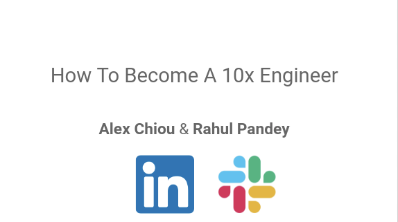</a>

[LinkedIn Event](https://www.linkedin.com/events/6794742587510140928/)

## How To Write A More Effective Tech Resume To Get More Job Opportunities
Here is the session recap for today's session, "How To Write A More Effective Tech Resume To Get More Job Opportunities":

**Meta Points**
* It is crucial to remember that a recruiter will be reading a resume. Most resumes are written as if an engineer similar to the writer will be reviewing it, which is wrong. Here’s what’s important to remember with the recruiter angle:
    * They are non-technical
    * They don’t have a lot of time (7.4 seconds on average) to read your resume
* You need to stand out!
    * This is especially true for junior engineers - Job postings, especially those from the top tech giants, will have hundreds of applicants.
    *  When looking at your completed resume, look at it and see if there’s anything on it that feels special and isn’t something that millions of others have done. While basic proficiency was impressive 20 years ago (like being able to get a clean website up and running on your own), it is meaningless now due to the explosion of infrastructure services and quality tutorials.
* Keep it simple
    * In general, you want to be conservative/plain when it comes to your resume formatting. Readability is key!
    * Be wary of sites that charge you for fancy resume templates - They are generally harder to read and will likely hurt you instead of help

**Keep It Short And Focused**
* Rule of thumb: 1 page tops for every 5 years of experience. In general, strive to have a 1-pager resume.
* Avoid the instinct of including everything you have ever done to try to claim as much “credit” as possible - Especially if it’s not very directly related to software. Trim the fat!
* Resumes often have a skills overview section (this is useful to quickly signal to recruiters what stacks you have experience in), and you should be very, very careful about what you put here. Don’t just put down anything you have ever worked with.
* Aggressively compress old experience. It is likely not relevant anymore, and you probably don’t remember much about it. This is also a safety mechanism for you, because if you’re grilled on old experience you don’t remember very well, you might just fail the interview then and there.
* Watch your spacing!
    * Shrink your margins if you can
    * Keep whitespace separations reasonable
    * Look for “dangling” newlines where you just have a few words on an entire line all by themselves. Try to shrink this point or add more “meat” to it

**Spelling And Grammar Matter**
* Your resume should have 0 obvious spelling/grammar mistakes. This is one of the easiest ways recruiters toss out resumes.
* Your resume is a document that you have a massive amount of time to work on, and it’s only 1 page (most of the time). If you aren’t willing to take the due diligence to make this crucial professional document clean, it is a signal to employers that you won’t be someone who is diligent and hard-working on the job.
* Take advantage of free tools like Grammarly that help you with this.
* If English is not your first language, look for people in your communities who are good with English and ask them for an English-only audit of your resume. Triple-check the resume yourself as well.

**Show, Don’t Tell**
* Meta-point: This is the concept that people struggle with the most, and it is arguably the most important idea to master.
* Everybody wants to and can say that they’re a good engineer. In order to stand out, you must show that you’re a good engineer.
* You do this by capturing the impact of your accomplishments (i.e. what is the delta you produced) and dictating it in a very concise, accessible way (remember, a recruiter is reading your resume!).
* Tactical tips:
    * Avoid brag summary sections with cliches
    * Don’t self-rate - This is a recipe for disaster if you are interviewed by somebody incredibly senior in that field
    * If you can show a number (i.e. metric), you’re probably on the right track. To avoid revealing confidential company information, use public statistics (e.g. # of installs on an app) and deltas (I increased X metric by 10%).
    * Deploy projects to prod and link that - A GitHub repo is meaningless to a recruiter!
    * Don't include personal info like your picture (save that for LinkedIn) and try not to tell your entire life story in general

**Have Basic Organization**
* 1 column is optimal to reduce cognitive load. 2 columns is also doable, and everything above that is too much.
* Have clear sections with dividers.
* Avoid lengthy paragraphs. Split them up into punchy bullet points.

**Most Practical -> Least Practical**
* For software engineers, companies want to know the answer to the following question: Can this person ship code in a professional, production environment?
* Go-to ordering working backwards from this question (after skills overview section):
    * Prior work experience: Other instances of you shipping code in professional, prod environment
    * Side projects: You’re still shipping code to prod, just not in a formally professional environment.
    * Education (this is generally higher than it should be):
        * University - Generally more abstract/theoretical and schools teach very outdated tech very often. 
        * Bootcamps - More on the practical side, but too short and work is often very “tech-demo-ey” so not a real production environment
**FAQ**
* Should I include my work experience if it’s not in the software industry? 
    * Yes, in general you should include your “Irrelevant experience”, especially if you’re earlier in your career 
    * If you have a lot of other relevant work experience, don’t include it (eats up valuable space)
    * If you’re looking for an entry level job - include it. Any experience is better than no experience.
    * If you’re a career changer - include it. Showing your past experience is better than having long gaps/unemployment in your employment.
* How can I talk about my impact without revealing company confidential info? 
    * New York Times test is helpful here: if you wouldn't want to see it on the home page of the NYT with your name attached, don't put it on your resume.
    * Talk about relative improvement, e.g. “onboarded customers 30% faster”
    * Obfuscate details: “increased ad revenue from $X0 million to $X00 million”
* Should I customize my resume for each job I’m applying to? 
    * At most, create a couple "archetype" resumes if the companies you apply to are meaningfully different
    * Job searching is a numbers game. You don't want to make a custom resume for every application, because that would take forever.
    * Startups will value customization/thoughtfulness more than big companies (who will barely care)

**Concluding Meta Point**
* In the end, this session is about optimizing presentation, not the content itself. You can think of these resume tips as the “dressing” around your professional “core”, which is what you have actually accomplished. If your core is weak, you will have a hard time getting job opportunities - No amount of dressing will fix this.
* If you aren’t getting the job opportunities you want due to a lack of experience or clout from top tech companies on your resume, you should join us for our sessions on side projects, starting off with the next session after this one! Side projects are a lever that anybody can use to make their “core” extremely strong; let us teach you how!
* People don’t realize that you can effectively create something very close to formal work experience in the comfort of your own home. A tech company’s purpose is to ship a software product to thousands/millions of users. You can do the exact same thing via side projects.

Here are the slides we used as well:

<a href="https://docs.google.com/presentation/d/1QK6G3fy0PlUzKpNxOj1PMgCL9hfHq6WDyVoMHhECg6Y/edit#slide=id.p"> 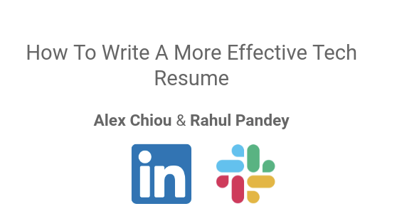</a>

### YouTube Recaps
#### Why You Should Be BORING With Your Tech Resume 
Alex and Rahul gave a talk for our Tech Career Growth community about writing an effective resume. This is a portion of that session. For the full recap, join the Slack community linked below. Video :arrow_right: :movie_camera:

[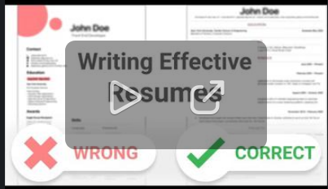](https://www.youtube.com/watch?v=MByD2CTwfmM)

#### THIS Is Why Your Resume Is Bad - Telling vs Showing
Let's improve a resume by showing the business impact. We also talk about the importance of side projects - in tech you don't need "experience" since you can create your own.

[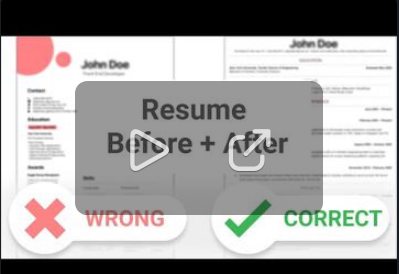](https://www.youtube.com/watch?v=sDbK84GEE94)

[LinkedIn Event](https://www.linkedin.com/events/6796262997103915008/)

## How To Come Up With 100k+ Users App Ideas You Can Build For Free
**Why Side Projects**
* The point of a tech company is to ship software products to tons of users at scale. Side projects are the closest thing you can get to work experience without actually getting work experience. 
* Side projects maximize learning, because software is inherently chaotic. You learn the most when you’re free-styling and don’t have guardrails (tutorial, certification, etc). 
* Building software which has value has become easier and easier in the last decade. In the next 5-10 years, having a meaningful side project will be a prerequisite for a good software engineering job.
It’s extremely fun and fulfilling.

**Look For Problems**
* Work backwards from a problem. Don’t work forward from a trendy piece of technology (blockchain, computer vision) or an existing popular app, e.g. “Airbnb for X!”
* We are living in the age of innovation - imperfections are opportunities. 
* If some relatively small process seems just a tad frustrating or inefficient to you: Congratulations! You may have discovered a golden side project opportunity.
* Two dimensions to evaluate side projects are feasibility and excitement. We are always working on increasing our feasibility, but you can also improve your level of excitement. Train yourself to get excited by ideas by connecting it to a larger vision, and your (simple/small) project is a stepping stone toward that.

**Think Small**
* Solve for as small a problem as possible. This is a side project, not a full-blown startup.
    * The smaller it is, the more likely you are to actually publish something. Avoid “zombie projects”.
    * Publish something limited but focused and polished. From there, iterate on it. “Done is better than perfect”
    * Developers underestimate how hard it is to solve a small problem with high quality.
* Keep it local - You shouldn’t try to save the world and help billions of people with your side project. Solve for a problem that is within your life or a friend’s life. You’ll be more passionate about it, you’ll have a tighter feedback loop, and you’ll “succeed” even if your app doesn’t become huge. 

**Keep The Tech Simple**
* You have now identified a problem and are now envisioning an app that solves it.
* There are 3 “levels” of product technical complexity:
    * Local utility apps - No back-end, no accounts, everything local to device.
    * Full-stack app - Accounts, back-end with an API and storing data to a database
    * Apps with integrations and interactions - Full-stack app that most of the beloved apps (Facebook, Airbnb, etc) fall into. Has people interacting with other people/institutions in some way.
* Unless you have a compelling reason, You should only be building “Level 1” apps. People severely underestimate how much complexity and depth goes into this. Random Name Picker is the result of 70,000+ lines of code changes! UI on its own is hard: screen sizes, poor network, bad inputs, intuitive design, etc. 
* “Level 3" projects are poor choices since the problem isn’t mainly technical anymore (people interacting with each other) and will have a huge BizDev (Business Development) component. 

**Scout The Competition**
* The idea is simple: Search for products already solving the problem you have and evaluate them.
    * If you’re building mobile apps, search the Google Play/Apple App store.
    * If you’re building a website, search Google.
    * If you’re building some sort of library/API, search Google/GitHub.
* You are looking for 2 core signals:
    * The competition has a decent amount of traction
    * The competition isn’t perfect. If you’re solving for a “Level 1” micro-problem, the competition almost certainly won’t be perfect.

**Be Patient & Keep Trying**
* It takes a while to come up with good ideas. Your first few ideas probably won’t be as big as you want them to be. That’s okay. Quantity over quality. 
* Even good ideas will take a while to “blossom”. Random Name Picker was at single digit downloads for months.
* “Plan to throw one away; you will anyhow” - Fred Brooks, The Mythical Man Month. Side projects have the beautiful characteristic that you are able to throw it away: no one has paid you in a contractual obligation, you understand the whole thing, there’s no communication overhead.

**The Power Of Mobile**
* Mobile has more opportunity than web as it’s newer and therefore has far less competition. If you want to maximize your chances of getting those 100k users, build for mobile.
* For mobile, Android is far superior by virtue of having way more users than iOS (3-5x). I am consistently surprised by how many random apps can get 10-50k installs.
* Impact is easier to gauge as the developer consoles give you all of that “for free”.

BTW, here is @Alex’s portfolio of published Android apps: :arrow_heading_down: 

<a href="https://play.google.com/store/apps/collection/cluster?clp=igM4ChkKEzkwOTM0Mzg1NTM3MTMzODk5MTYQCBgDEhkKEzkwOTM0Mzg1NTM3MTMzODk5MTYQCBgDGAA%3D:S:ANO1ljK98hk&gsr=CjuKAzgKGQoTOTA5MzQzODU1MzcxMzM4OTkxNhAIGAMSGQoTOTA5MzQzODU1MzcxMzM4OTkxNhAIGAMYAA%3D%3D:S:ANO1ljJDe_k"> 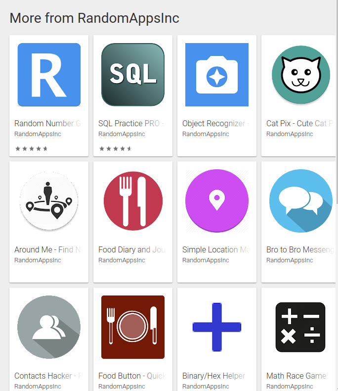</a>

### YouTube Recaps

#### How To Build Apps With 100k+ Users: Feasibility vs. Excitement
The video covers a common misconception when it comes side projects: In order for something to be exciting, it has to be incredibly complex (and therefore not feasible). If something is feasible and simple, it is boring and not worth doing.

This is 100% not the case: There is a lot of beauty in simplicity, and there are a ton of projects that are both very feasible and extremely exciting.

Anyways, check out the video to figure out how you change your mental framework to start recognizing these kinds of ideas. These are the ideas that you can both easily build and get a ton of users for, supercharging your resume and unlocking amazing job opportunities.

[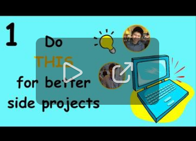](https://www.youtube.com/watch?v=6vDwkELh4CQ)

#### How to SUPERCHARGE Your Software Engineer Resume
Howdy team - Addy Hebou here! I’ve been creating the video snippets and the logo design from the sessions that Alex & Rahul put on, so I’ll be posting here occasionally with new videos - starting with this one!

Have you ever heard of the expression “you can put all the makeup on a pig, but it still doesn’t make it pretty”?

It’s the same way with tech resumes - without enough experience, it’s hard to display substance in a resume. So what’s the best way to gain that substance? To make that content? You guessed it - side projects.

Especially for those with low experience, side projects are arguably the #1 alternative to display experience outside of employment. Projects that can generate hundreds, even thousands of users monthly, project to employers that you know how to program to gain customers, which is crucial for companies.
Check out all that Rahul Pandey and Alex Chiou have to emphasize about the importance of side projects here: https://lnkd.in/dQK2Utb

[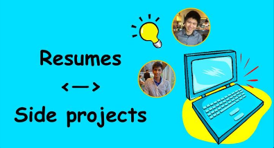](https://www.youtube.com/watch?v=6vDwkELh4CQ)

#### How To Identify 100k+ Users App Ideas You Can Actually Build - Good Idea vs. Bad Idea
[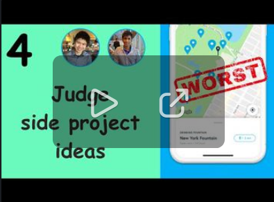](https://www.youtube.com/watch?v=k_jPKGKMojI)

[LinkedIn Event](https://www.linkedin.com/events/6801549135905464320/)

## How To Manage Your Time Optimally In Tech And Achieve More Results
The session from this evening about time management was so much fun!

**Key Points**
* You can’t create more time like can create more of other resources. It’s worth thinking about how you spend your time, and consequently, your life.
* Focus on your system. This is the most important point we covered. Your willpower to do things will change day-to-day, but your framework doesn’t. Create a system that makes it easy to do the right thing and hard to do the wrong thing (procrastinate).
* We covered 5 pillars of an effective time management system, covered below.

**One Big Thing**
* Establish exactly one thing which must get done the next day. Write it down so it’s out of your head. 
* Calibrate the size of the task to ensure you can get it done in the next day.
* One item allows us to start ruminating on the problem. There should be no ambiguity around what exactly needs to happen and how to get started. Clarity leads to action.
* “Integrate Twitter Authentication” is bad. “Go to developer twitter com, create a Twitter app, and then pull up the documentation for OAuth 2.0” is better

**Reflection**
* If (when) you screw up, we should learn from the experience. We do this with reflection.
* Ask “why” several times. “Why did you fail to meet the objective you had?” Due to procrastination. “Why did you procrastinate?” Because there wasn’t clarity on how to get started. “Why wasn’t there clarity? What could you have done to gain that clarity?”
* Schedule a 30 min block with yourself every 2 weeks to reflect on how things went. Were there particular meetings of periods that were especially productive or unproductive?

**Focus**
* Deep work: the ability to focus without distraction on a cognitively demanding task (book by Cal Newport)
* One big way we do this is to avoid context switching. You need to operate proactively instead of reactively.
* Tactically, when I’m in focus mode, I’ll move my phone out of arm’s reach. This introduces a bit of friction before I mindlessly unlock my phone.
* Turn off notifications from almost everything: email, LinkedIn, Twitter, etc, and use batching.

**Eat the Frog**
* The best time to eat a frog is first thing in the morning. The best time to do any large, difficult task is right when you wake up - don’t give yourself the chance to put it off.
* Instead of checking email, Instagram, or anything else, wake up and set a timer to work on your top priority for that set time.

**Leverage Social Pressures**
* Working with others will help you see what’s possible, and they’ll offer help if you’re feeling low or stuck.
* You can find a mentor (someone more senior, a coach), or a peer (someone going through what you’re going through)
* Shame is a powerful driver of action. If you tell someone you’ll get something done by a certain date, there’s a fire to actually get it done.

**Meta-points**
* Sleep + exercise are critical. Don’t be a zombie with reduced ability to focus/debug issues.
* TV/movies/gaming: it’s ok if you do these, but you need to be in control of your consumption. In general, we want to create more than we consume.

[LinkedIn Event](https://www.linkedin.com/events/6807069050255106048/)

# How To Ace Your Big Tech Interview With Data Structures And Algorithms
Hey everyone, thanks so much for your support for the earlier session today about interviewing for Big Tech, specially on the DSA portion. As usual, here's a thorough session recap for those who missed it or just want something for your notes.

**The Mental Game**
* Progress with DSA will be exponential. You will struggle in the beginning for a long time. You will eventually hit an inflection point where you start recognizing patterns and finally feel like you’re making real progress. Hang in there.
* Sometimes it’s not clear what steps you need to take to achieve a goal. For example, I used to have a goal of making at least one code change in a project everyday (Github commit streak). There’s nothing inherently wrong with this, but if the higher-level objective is to build a startup, a goal of writing code everyday is unlikely to be the best measure of progress.
    * Thankfully, there are many examples where a specific and measurable goal is perfectly aligned with the longer term. Running a marathon is the prime example; running has a purity where the short term goals clearly build up to longer term goals. The path to success is as simple as sticking to the plan. There’s no luck (or thinking) involved, just an indomitable will combined with a deep work ethic.
* Take breaks! As mentioned before, interviewing is exhausting; if all you do is grind and cram, your mental state will not be good enough for the interview. Alex’s rule of thumb: ~30 minute break for every 2 hours of work.
* Find an interview buddy if you can. It’s so helpful having some semblance of something simulating the real thing vs. staying purely in the realm of study. Social accountability is also extremely powerful.
* To further stay motivated, remember that mastering DSA for a Big Tech interview is one of the highest ROI activities any human being can do:
    * A couple months of effort -> Tens of thousands of $ in increased compensation, maybe even $100k+
    * After working for Big Tech, you will never have to apply online or cold message ever again. Every company will come to you.
    * You learn from the absolute best working for Big Tech. Your growth will be put into hyperdrive.
* Turn it into a habit like exercise. DSA is not meant to be done in giant bursts.
* Do not cram! Relax before the interview instead. It is crucial that your mental state is nimble going into DSA rounds. You will likely get a problem you haven’t seen before.
* Don’t view the opportunity as make or break. Treat it as much as any other day; Alex views all his interviews as just a chance to chat with some cool tech people. The less you care about the interview, the less stressed out you are. It’s okay if you will; there will be more chances.

**Preparation**
* Just buy Leetcode Premium - We all love to save money, but Leetcode Premium is a no brainer if you are interviewing with any big company. Even if it only increases your chances of getting an offer by 5%, that’s a 5% higher chance for a job paying 100k+.
    * What to expect:
    * Phone screen: Leetcode easy and medium
* Onsite: Leetcode medium and hard
Glassdoor is an extremely valuable resource with Big Tech as its usefulness scales with company size. If you see a question that’s been recorded twice for your position, know how to solve it.
* If possible, use a compact, efficient language like Python/JavaScript since time control is crucial during DSA rounds. Avoid very verbose languages like C/C++.
* You are looking to learn patterns, not individual solutions. 80%+ of DSA problems fall within ~15 different core patterns. Don’t try to memorize individual solutions for everything; that is not scalable. You will also have to memorize some solutions for the really tricky hards; if you’re memorizing for easy/medium as well, you will quickly run out of brain space.
* Extensively write comments on the problems you solve; in particular, try to capture the key to the problem (e.g. sort the list and then use sliding window). You want to be able to convert keys to problems into all the code needed for the solution vs. remembering the code itself.

**Communication**
* The bigger the company, the more soft skills are valued. In particular, great communication skills are crucial.
* With Big Tech, it isn’t only about the right answer. It’s also about how you got to that answer (i.e. how well did you communicate with the interviewer).
* Interview process at Big Tech is streamlined and efficient. Interviewer is trained to get as much good signal from the candidate as possible. This means they want to collaborate with you. Relationship is bidirectional (you work together with interviewer) instead of unidirectional (you quietly solve the problem on your own and are then judged afterwards)
* Listen carefully to what the interviewer says. They may be trying to help you, especially when you have tunnel vision.
* 5 min+ of silence = bad. Don’t just write code in silence, especially as the language you’re using may not be the primary language of the interviewer.

**Process**
* Ask questions to clarify the scope of the problem
* Explain your overall approach to the problem
    * Done is better than perfect - You will often not get the optimal solution off the bat. It’s better to have a working sub-optimal solution vs. a half-finished “optimal” solution that doesn’t even compile yet
    * If you don’t get any red flags from the interviewer, proceed
* Start writing code
    * Solve for the core of the problem first, which is often the hardest part
    * Many candidates tackle the trivial portions first (e.g. write a utility method to convert an array of chars into a string), because that’s where they’re comfortable. These portions often aren’t even required by the interviewer and give low signal.
    * Adding on to the above point, ask if you can “hand-wave” pieces away. Utility functions can often be saved from this. Every saved minute counts!
    * Watch out for tunnel vision! Check every 5 minutes to see if the path you’re going down doesn’t feel right (you just can’t seem to get it to work). If you’re going to pivot, do it ASAP!

**Solution**
* Understand where your solution’s shortcomings are, whether it’s in performance or code structure
* Don’t forget about space complexity
* Understand how to come up with good test cases (i.e. extreme/wonky inputs)

I also recently wrote a massive LinkedIn post sharing a bunch more resources related to interviewing and Big Tech (including the slides we used), which you can find here: https://www.linkedin.com/posts/activity-6822250780913991680-gehC

LinkedIn is the main way we get the word out about this community, so any support on the LinkedIn would be appreciate. Have an amazing weekend everyone!

### YouTube Recaps
#### How To Have The Proper Mindset In Big Tech Software Engineering Interviews
We're super late on this, but here's the first video recap from the Big Tech interview session we gave on 7/17. It talks about how to have the proper mindset going into and during the interview. A lot of candidates (this probably includes some of you!) are more than capable of passing these prestigious interviews; you just get too nervous and anxious around the interview and are unable to show your true skill. This video talks about how to avoid that.

[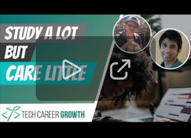](https://www.youtube.com/watch?v=guxFTl_qIRg)

#### How You Properly Learn Data Structures and Algorithms (DSA) 
Here's the next recap from July's Big Tech interview session, covering how to optimally learn data structures & algorithms. This video breaks down the studying techniques I used to get into Facebook:

#### How to Mentally Prepare for Your Tech Interview
Here's another recap from the Big Tech interviewing session, explaining how "feeling dumb" is naturally part of the process when it comes to mastering data structure and algorithms:

#### How To Truly Master A Data Structures & Algorithms Problem

#### Acing Tech Interviews Is More Than Just The Solution - How To Properly Communicate In Interviews 
I'm back with... you know what, haha. Anyways, here's another recap video from the Big Tech DSA interview session we had back in July, talking about the importance of communication in the context of Big Tech specifically and how to succeed on that axis:

#### Stop Wasting Time In Your Tech Interviews By "Inventing The API
We have one final snippet from the Big Tech DSA interview session :slightly_smiling_face: Time management is essential to succeeding in your coding interview. One tactic to do this is by “inventing the API”:

[Slides](https://docs.google.com/presentation/d/13uLUHDvZifjp2aVClGsW29nfuVpQYvrkGLP8cej0R_k/edit?usp=sharing)

[LinkedIn Event](https://www.linkedin.com/events/6815075152741695488/)

## How To Get Promoted Faster In Tech

Thanks everyone for joining our session about how to advance your career faster through promotions! Here are the relevant points:

**It’s About Behavior, Not Output**
* Raw output is not scalable. You can only get so fast at writing code and there are only so many hours in a day.
* Very senior ICs are senior because they act in a fundamentally different way compared to more junior ICs - it’s not about how fast you can code.
* Needing to work 12+ hours a day to be at the next level isn’t truly functioning at the next level, it could actually be a negative signal for promo.
* Good litmus test: How far in advance do you know what you’re going to work on?

**Increase Your Scope**
* Being senior almost always requires working through others
* Impact many people positively, adding multiplicative value instead of additive value, e.g. redefine a process that affects entire org like oncall
* In a high-growth tech company, I promise there will always be room to improve things
* Understand social capital: be cognizant of the relationships you need to build and work closely with those people and act with empathy
* One important part of getting positive peer feedback is the marketing aspect. You should make regular posts and status updates. This is valuable for 2 reasons:
  * If your work is truly adding value, then the status updates will be welcome
  * Your regular updates let you acknowledge the contributions from your teammates

**Work With Your Manager**
* Your performance review result should not be a surprise and your manager is held the most accountable for that
* People often don’t realize: They need to hold their manager accountable.
* Manager can’t read minds. You need to leverage them as a resource. Flip the understanding of you serving your manager. Your manager actually serves you.
* Write down a career growth plan with your manager.

**Managing Feedback**
When you give others permission to give you constructive feedback, you’re much more likely to hear it.
* Schedule a dedicated 1:1 with key influential people who can tell you your strengths and growth areas.
* These conversations should be awkward.

**Self Feedback**
* Think about what work you enjoy doing and are good at. You’ll do better if you spend time on things you enjoy.
* Humans are bad at remembering things, especially across a 6 to 12 month span. Good things are harder to remember as well.
* Write down your wins and keep a brag journal. This will help with perf review.

**Staying In Sync With Manager**
* It’s easy for managers to look track of what their reports are doing, especially if they have more reports or the company is fast moving.
* Share wins regularly with your manager
* Ask for feedback in the right way: “Here’s my observation about me and the team… what do you think?”
* Check in against the growth plan

**You Are In Control of Your Career**
You’re not beholden to your company, so you should feel empowered to switch jobs if you don’t see an opportunity for career growth.
* If your manager is unsupportive, or you have a strained relationship with influential people in the org, your promo case will be much harder.
* Promotions require a “business need” which you likely don’t have control over
* Companies are risk-averse with promotions, and you have very little leverage. Sometimes the easiest way to advocate for yourself is to get another job.

I’ll also point you to the [LI article](https://www.linkedin.com/pulse/5-things-i-wish-knew-promotion-engineer-rahul-pandey/) I wrote about promotion.

[LinkedIn Event](https://www.linkedin.com/events/6819793254716989440/)

## Answering Your Top 5 questions
Thanks to the ~150 of you who showed up for the Q&A session today! Here's a text recap of our answers to the Top 5 questions as we figure out the YouTube recap situation:

1. **For early in career folks, should learning be done breadth-wise or depth-wise?**
    * You go wide to discover something you’re passionate about and then you go deep on it.
    * You don’t need to find the absolute perfect thing; avoid decision paralysis.
    * The growth path for junior engineers is that they need to build “street cred”, getting to a really high level of technical proficiency to prove that they’re able to lead and grow into a senior role. This is really hard if you keep switching stacks.
    * There are fundamentals that are constant across every stack (what good code looks like, how to write a clean abstraction, etc). However, you don’t learn them until you go pretty deep into 1 stack, as in the beginning, you are just tactically focused on getting stuff to work.
    * Once you master a stack and have transferable fundamentals, you can branch out.
    * One learning tactic is just to read the terminology, then actually go deep and it will make much more sense. Similar to reading a textbook, where you read all the chapter names.

2. **How do you prepare a perfect portfolio to get recruiters to come find you?**
    * Pretty much LinkedIn since it’s essentially a really powerful and popular portfolio website that recruiters more or less live on
    * It’s not like recruiters are regularly browsing people’s portfolio websites as there isn’t a central repository of them
    * If you don’t have the work experience necessary to get recruiter leads, then invest into side projects
    * Side projects themselves can also get recruiter leads. I have gotten many recruiter messages at my Google Play developer email from top companies like Square, Instacart, etc.
    * There are no great tools for this, Github README is a good option, or a public page of GPlay or App Store link

3. **How do you get FAANG interviews?**
    * You need either a recruiter to find you or a referral
    * Applying online and cold messaging are effectively useless. You can try it every once in a while, but don’t spend more than a few minutes on your application/message.
    * Networking is crucial to get referrals. Getting into Big Tech is hard but not impossible. If you have 100 friends in tech, at least one of them will get into Big Tech within 2 years.
    * If you live in a relevant geography, Big Tech will come find you once you have 2-3 YOE. Once you have 5+ YOE (generally considered the cutoff for a senior engineer), you’ll really start getting opportunities.
    * “Nuclear” levers (to overcome junior-ness and bad geography):
       * Massive side project - At least 10k+ users
       * Major open-source contributions - Extremely clear way to show you’re capable of writing Big Tech level code, especially if you can merge into one of their repos. However, onboarding into such a strong codebase is extremely difficult.
    * Recruiters bias for pattern matching; they want to get as many people in the door who are likely to pass the interview.

4. **How do you balance between active office projects and self learning?**
    * It depends on your priorities.
    * If your goal is to get promoted at your job and you have a good support network there, you can just invest wholly into that. Essentially, if you’re learning a lot at work, you don’t need to do self learning.
    * If your work is not supporting you at all, you can just do the bare minimum to not get fired and use self-learning to explore other opportunities. This is what Alex did at PayPal to transition into Android.
    * In general, try not to get fired unless you are extremely financially comfortable.
    * For self learning, try to incorporate them into side projects so it doesn’t feel as much like work (another thing Alex has done). Getting off work just to go into studying for a certification or something is not fun. If your self learning also feels like work, your brain won’t be able to handle it. There are many studies showing that the human mind simply cannot handle 40+ hours of work per week.
    * You care about your career x 100, your startup cares about your company x 50, your big company cares about your career 10.
    * It sounds scary but it’s actually liberating when you realize you can do things on your own.

5. **What are your strategies for stopping procrastination?**
    * You can only procrastinate with a far-off deadline and you generally only have far-off deadlines with big items. This means you can break down whatever your big task is into smaller tasks and milestones, with a small chunk being due at regular intervals.
    * Social accountability is also powerful. You don’t want to be the person holding the team back. Find a buddy! One way to aggressively get rid of procrastination is to turn work into a race among the team.
    * If you’re procrastinating but able to make the deadline anyways, you aren’t being challenged enough. Just move the deadline up if it’s something you set yourself.
    * Turning things into a habit is extremely powerful. If the inertia for you to get going is really high, confront that inertia head-on by making a little bit of progress every single day or something close to that.
    * Meta-point: Procrastination often stems from a lack of true passion and enjoyment. If you find yourself regularly procrastinating a certain type of work, ask yourself if you are in the right area to begin with.
    * Use "just one thing" tactic, reflection, focus. Think about the next physical action.
We will try to publish our responses as videos as soon as possible. Since a lot of folks weren't able to make this session, we will prioritize speed and quantity over quality here; we just want to get these out the door as soon as possible, and I'm sure many of you feel the same way. 

### YouTube Recaps
#### Landing an Interview at a Big Tech Company for Engineers - How Do Recruiters Think?

#### How to Balance Your Time Between Your Job And Self Learning
[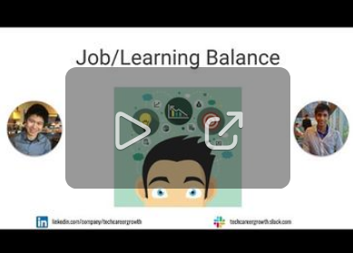](https://www.youtube.com/watch?v=qHYh_fiWH2Y)

#### How do you prepare the perfect portfolio to get discovered by recruiters?
[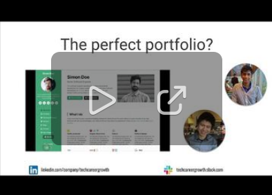](https://www.youtube.com/watch?v=Rh6hA9g6SUM)

#### As a software engineer, should you learn new technology with breadth or depth?

#### How To Stop Procrastinating - Time Management Tips
[Video Link](https://www.youtube.com/watch?v=64EnzHsQTMo)

[LinkedIn Event](https://www.linkedin.com/events/6821285790581190656/)

## How To Write A Stellar Resume That Gets You More Job Opportunities
Today was our session about how to write a tech resume that gets you more opportunities. Main points we touched on:

**Meta**
* Remember that a recruiter will be reading a resume. Two important things to keep in mind are (1) They are non-technical and (2) They don’t have a lot of time (7.4 seconds on average) to read your resume.
* Recruiters make 3 piles of resumes: yes, no, maybe. Your goal is very simply avoid the “no” pile, and ideally get into the yes pile. Our advice is fairly straightforward - be weary of anyone charging you for money to create a “fancy” resume.
* Especially for junior engineers, having a clear resume is essential. The top tech giants will have hundreds of applicants. Look at your completed resume and check that it’s clear, and ideally, contains something unique + impressive.

**Keep It Short And Focused**
* Rule of thumb: 1 page max for every 5 years of experience. In general, strive to have a 1-pager resume. Alex’s resume is only 1 page despite having ~7 years of experience.
* Avoid the instinct of including everything you have ever done to try to claim as much “credit” as possible - Especially if it’s not very directly related to software. Trim the fat!
* Resumes often have a skills overview section Be very careful about what you put here — you should be able to talk about these in depth.
* Aggressively compress old experience to stick to 1 page, don’t feel shy about cutting out old internships/jobs.
* Watch your spacing!
  * Keep whitespace separations reasonable
  * Look for “dangling” newlines where you just have a few words on an entire line all by themselves.

**Spelling And Grammar Matter**
* Your resume should not have spelling/grammar mistakes.
* Your resume is a document that you have a massive amount of time to work on, and it’s only 1 page. If you aren’t willing to take the due diligence to make this crucial professional document clean, it is a signal to employers that you won’t be someone who is diligent and hard-working on the job.
* Take advantage of free tools like Grammarly that help you with this.
* If English is not your first language, look for people in your communities who are good with English and ask them for an English-only audit of your resume. Triple-check the resume yourself as well.

**Show, Don’t Tell**
* This is the concept that people struggle with the most, and it is arguably the most important idea to master.
* Everybody wants to and can say that they’re a good engineer. In order to stand out, you must show that you’re a good engineer.
* You do this by capturing the impact of your accomplishments (i.e. what is the delta you produced) and dictating it in a very concise, accessible way (remember, a recruiter is reading your resume!).
* Tactical tips:
  * Avoid brag summary sections, things like “fast learner” or “team player”
  * Don’t self-rate your skills or familiarity in a technology
  * Deploy projects to prod and link that - A GitHub repo has little value to a recruiter!

**Resume Before and After**
  * Putting technologies next to job is good since it contextualizes what you did
  * Focus on business impact. Customers don’t care about the tech, they care about getting something done.

**Have Basic Organization**
* 1 column is optimal to reduce cognitive load. 2     columns is also doable, and everything above that is too much. Everyone reads top to bottom - put important things first.
* Have clear sections with dividers.
* Avoid lengthy paragraphs. Split them up into punchy bullet points.

**Most Practical --> Least Practical**
* For software engineers, companies want to know the answer to the following question: Can this person ship code in a professional, production environment?
* Go-to ordering working backwards from this question (after skills overview section):
* Prior work experience: Other instances of you shipping code in professional, prod environment
* Personal projects: You’re still shipping code to prod, just not in a formally professional environment.
* Education (this is generally higher than it should be):
  * University - Generally more abstract/theoretical and schools teach very outdated tech very often. 
  * Bootcamps - More on the practical side, but too   short and work is often very “tech-demo-ey” so not a real production environment

**FAQ**
* Should I include my work experience if it’s not in the software industry? 
  * Yes, it’s typically worthwhile to include “Irrelevant experience”, especially if you’re earlier in your career 
  * Showing some experience is generally better than none, or showing long gaps in employment.
* How can I talk about my impact without revealing company confidential info? 
  * Talk about relative improvement, e.g. “onboarded customers 30% faster”
  * Obfuscate details: “increased ad revenue from $X0 million to $X00 million”
* Should I customize my resume for each job I’m applying to? 
  * In general, this is not worth the time
  * There may be value if the companies you’re applying to are meaningfully different.

**Conclusion**
* This session is about optimizing presentation, not the content itself. You can think of these resume tips as the “dressing” around your professional “core”, which is what you have actually accomplished. If your core is weak, you will have a hard time getting job opportunities - No amount of dressing will fix this.
* If you aren’t getting the job opportunities you want due to a lack of experience or clout from top tech companies on your resume, you should build personal projects
* People don’t realize that you can effectively create something very close to formal work experience in the comfort of your own home. That’s our next session on Oct 2: https://www.linkedin.com/events/howtobuildandgrowtechproductsto6835076235345956864/

[LinkedIn Event](https://www.linkedin.com/events/6824212767390756864/)

## How To Build And Grow Tech Products To 500k+ Users For Free
Thanks to everyone who joined us today about building + growing personal projects with 500K+ users! Session recap:
**We are extremely bullish on personal projects.**
* They can be just as valuable  (or more) as work experience if you get users
* Best non-professional learning, you’re creating “business impact” on your own
* Personal projects can help many people, it’s impactful work
* Showing off your interests can unlock career paths
* Hacking on stuff is fun + fulfilling
    
**Minimum Viable Product**

**Just 1 Thing**
* A good initial product is something that solves a specific user problem in a hyper-targeted way. Keep it simple, focused, and polished.
* Your goal is to have as few features as possible
* Go for depth over breadth. It’s far better to have 1 feature with extremely high quality vs. several with average to low quality.
* It’s ok if you want to do more, plan out your vision in terms of phases, and be clear about which phase you’re working on.
* Features you might not need: login/signup, a back-end, or a marketplace

**Quality Is Key. And Difficult.**
* With the software boom, effectively every original idea has been exhausted. Innovation is overrated, execution is underrated
* Create apps with the highest quality, which is best for your learning and will get you more users.
* Think through the edge cases (Random Name Picker example: empty state, invalid input, deleting names, etc)
* Angry users are very loud

**Least Clicks Design**
* If there’s 1 design concept to remember, it’s this: Minimize the amount of clicks it takes for the user to do your core action.
* Less than 3 clicks and/or 5 seconds to do the core user flow
* Make sure “90%” flow is always fast - push complexity behind menus like bottom sheet

**Free Is Powerful**
* 2 core types of free: Product itself is free and there’s no ads (i.e. ad-free)
* People love free. If you’re building a product to strengthen your portfolio, learn, have fun, help people, and unlock job opportunities, you should leverage that as a superpower. Make your product, at least initially, free and ad-free.
* There are so many product spaces dominated by hucksters trying to nickel-and-dime people with ad-infested apps.
* You need your initial users to love your app, and that is very difficult to do if it’s paid or has ads.

**Growing The Product And User Base**

**Eat Your Own Dogfood**
* The most important user of your product is you
* If you don’t use your own product, it is hard to build user empathy as you’re not going through the pain yourself
* In the beginning, your product will feel clunky, both due to a lack of features and inefficiencies with your core flow. Dogfooding empowers you to fix this.
* You will have very little user feedback to go off of initially, so you need to do this to fuel the initial iteration.
* Alex used Random Name Picker for board game nights to help select the board game to play and the restaurant to eat at.

**Feedback Is A Gift**
* User feedback is free product management: It’s really rare that the problem a user faces is unique to them, so just fixing their problem almost certainly improves your product and makes users love it more.
* Don’t be defensive with bad reviews. They often have clear, actionable feedback - The angry words are essentially wrapping up a valuable gift. Fix their issue, apologize in your reply, and let them know when the fix is out.
* Respond to every review. This is especially important initially as those users are the most valuable (every rating has a lot of weight, they took a chance on you).

**Understand SEO**
* SEO is really not that hard: Figure out popular terms that users are searching for that are relevant to your product and include them, primarily in the title and description
* Pretend you are somebody looking for an app/website to solve your problem and just let your fingers do the typing - What do you search for?
* Look at competitor apps: how can you do better? What features can you add?

**Keep Iterating And Improving**
* Like a lot of things in tech, particularly interviewing, product development is a marathon, not a sprint
* You can’t just release a v1 and expect it to explode. That’s the exception, not the rule. 
* Commit to at least 15 updates across 2 months. After that, if there’s still no traction, move on to something else.
* For the mobile stores in particular, update frequency are almost certainly factored into the search ranking algorithm

### YouTube Recaps

#### The BEST Way To Learn As A Software Engineer - Always Be Building
We now have our 1st recap video from the side projects session on 10/2! In this video, we explain all the benefits of seriously building personal software projects and how it's much more conducive and symbiotic towards your growth vs. more "traditional" activities like DSA grinding: 

[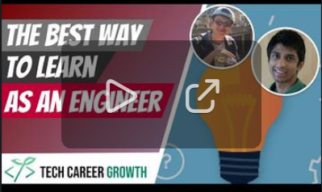](hhttps://www.youtube.com/watch?v=Ciu8zwOr8PU)

#### How To Build An Amazing Product - Do Just 1 Thing
Continuing on to the 2nd recap from the personal projects session :tada: The most common mistake people make when building projects on their own is trying to make something too complicated.

[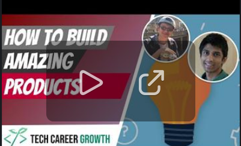](https://youtu.be/voUyG75SMLw)

#### Where The TRUE Learning As A Developer Comes In - Winning With Quality
This video is about something that is seriously underrated: Quality. As alluded to in the "How To Learn Quickly In Tech" session as well, true learning comes when you really push a product/component to its limit, building something that is truly robust, smooth, and delightful. This is where junior engineers often struggle when building personal software projects.

[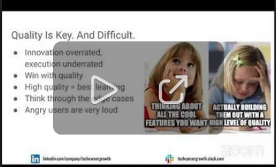](https://www.youtube.com/watch?v=144YS6pZuqo)

#### The EASIEST Way To Make Users Love Your Product - The Power Of Free 
Hot off the press, here's another recap video from the side projects session on 10/2. It covers an extremely powerful and 0 effort way you can make your personal software project 10x more appealing as a product compared to the rest of the field:

[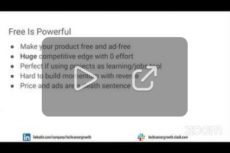](https://www.youtube.com/watch?v=jM-kV1geEP8)

#### This Is How Facebook Makes Amazing Apps - The Importance of Dogfooding 
Here’s another one: the importance of eating your dogfood. Basically, make sure you use the product you’re building so you know how to improve it!

[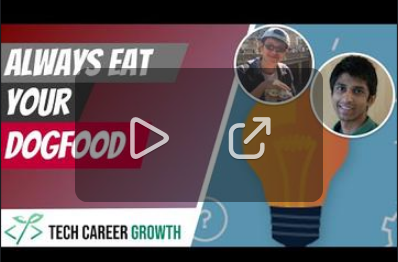](https://youtu.be/8f_XVXeYNas)

## How to Learn Quickly in Tech
Thanks everyone for joining today about our session “How to Learn Quickly in Tech”!! We’ll eventually post snippets of the session on YT, but for now, please enjoy this text recap:

**1. Ask effective questions**
* Guiding principle: make it easy for others to help you
* Asking good questions not only helps you, but the whole team: your question (plus follow up) will help others struggling in the same area.
* Rule of thumb: if you’re struggling for > 15 min, ask a question
* Avoid the leading hi, pass the 1st round Google test, Include context, and be appreciative!

**2. Learn by doing**
* The cost of writing (and rewriting) software is low, which means that you should jump right into doing/building
* The best way to learn a new programming language or technology is to start tinkering
* Don’t waste time on: waiting for a certificate, or reading excessive documentation
* Share what you know, the reflection that you do will help you learn

**3. Feedback is a gift**
* Most of the people you work with are smart and well-intentioned, so their feedback will unlock lots of learning.
* Invite feedback: you’re much more likely to hear it if you ask for for it. 
* Write down feedback and convert it to action items -- this builds social capital.
* If you don’t have colleagues to give you feedback, use the Tech Career Growth channel.

**4. The Lego model**
* We combine legos in different ways to create valuable structures. 
* You can think of tech components as legos, and we combine these into products.
* To learn quickly, collect lots of legos and make sure they’re high quality + in demand.
* Good legos: onboarding flows, displaying a list of items, displaying images

**5. Build a powerful learning roadmap**
* You’ll maximize your learning if you move away from strict structure and build your own things
* Learn to embrace discomfort and unknowns - this is a constant in the tech world
* Work backwards from your destination, instead of following an exact prescription
* https://www.imberapp.com/ is designed to give you feedback + encouragement on your personal projects as you create your own experience 

Slides

### YouTube Recaps

#### How To Ask Amazing Questions That Get Answers Fast 
Here's the snippet from our "How To Learn Quickly In Tech" session on 10/16 where we break down how to ask an effective question. If you're a junior engineer trying to find your way within a new team or you're just trying to get some great answers within this Slack community, definitely check it out here

[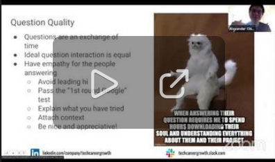](https://www.youtube.com/watch?v=VS75nql2Csg)

#### Bad Question vs. Good Question Example - Tech Career Growth 
Following up on the prior recap video, here's a snippet where we break down an in-depth example with what is originally an ineffective question, which then turns into an effective question

[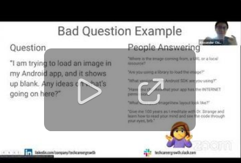](https://www.youtube.com/watch?v=24CGlaL5bXo)

#### This Is How To Learn A New Codebase FAST 
Here's our latest session recap video, which covers how to learn a new codebase the most quickly. Definitely do this if you're a freshly hired junior engineer trying to learn the ropes of your new team!

[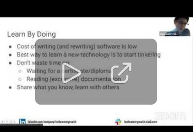](https://www.youtube.com/watch?v=QLCq91qrMC0)

#### Why You Should Be The DUMBEST Person In The Room 
For those of you who missed the "How To Learn Quickly In Tech" session, here's another recap video from it, explaining why you should try to be the dumbest person in the room to maximize your growth: https://www.youtube.com/watch?v=1jJf0ehQ7Fo

[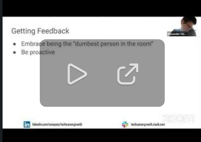](https://www.youtube.com/watch?v=1jJf0ehQ7Fo)

#### There Is No Such Thing As A Stupid Question 
Hey everyone, we recently wrapped up our video recaps for the question asking portion of the "How To Learn Quickly In Tech" session.

If there's one series of recaps you should absolutely watch, it's this one because, well, you're in this Slack community and the main thing we do here is ask and answer questions. Questions are one of the most powerful tools for any engineer's growth and one of the most straightforward as well: We all grew up asking questions, but very few of us grew up building globally deployable #side-projects for example. However, there's 3 things that make question asking hard:
* Mustering up the courage to ask the question in the first place
* Adding enough context so that it can be easily and effectively answered
* Using it as a social-capital building mechanism to actually build respect and relationships as opposed to being a purely  tactical mechanism,

This is why @Rahul Pandey and I covered question asking in 20+ minutes of content across 4 videos; there's really a lot more to it than people think. Anyways, we hope this helps!

You can find them all in the playlist here:

[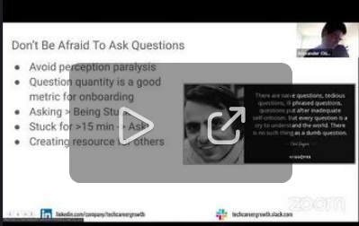](https://www.youtube.com/watch?v=fVgZBX0yinc&list=PL7NYbSE8uaBATZh90IhQgGJNulKUpRfYY)

#### The #1 Tactic To Become A Senior Engineer Faster
Feedback is critical to getting better as an engineer. In this video, @Alex and I talk about the best ways to receive more high-quality feedback from the people around you. For example:

* In 1:1s, instead of just saying “Do you have any feedback for me?” say “What should I start doing to be more effective? What should I stop doing?”
* In code reviews, proactively identify areas where you’d love extra eyes or feedback

Let us know if these help!

[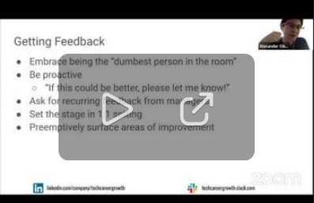](https://youtu.be/r6D9dirIqLs)

Check all the entire playlist for this session :point_right: [YouTube PlayList]( https://www.youtube.com/watch?v=Ciu8zwOr8PU&list=PL7NYbSE8uaBC_YrNV4a67PEu77dCDfNLF)

[LinkedIn Event](https://www.linkedin.com/events/6847960498936406016/)

## How To Ace Your Big Tech Interview - System Design
Starting off the session recap early this time (we're still doing the session!) - Anyways, here are the slides we used for the system design interview session:

[LinkedIn Event](https://www.linkedin.com/events/6853430990732439552/)

Remaining recap material is TBD.
